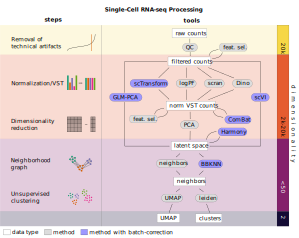

# single-cell-preprocessing-figure
An overview of different single-cell processing paths (from counts to UMAP)

Starting with
an unfiltered, high-dimensional count matrix, technical artifacts such as doublets and
low-quality cells are removed. Normalization and variance stabilizing transformations
(VST) of filtered counts can be performed with various strategies. Optional feature
selection (feat. sel.) of ca. 2000–6000 genes can be performed on either filtered or
normalized counts. Based on the normalized, transformed counts, a low-dimensional
latent space can be computed using principal component analysis (PCA). Alterna-
tively, other methods can derive a latent space directly from the filtered counts. Us-
ing the latent space, a neighborhood graph is derived, which serves as the basis for
unsupervised clustering and dimensionality reduction methods such as uniform man-
ifold approximation and projection (UMAP). Batch effect correction may be applied
as dedicated steps at different points in the workflow, or may be integrated in other
processing steps.

License: CC-BY 4.0 International
